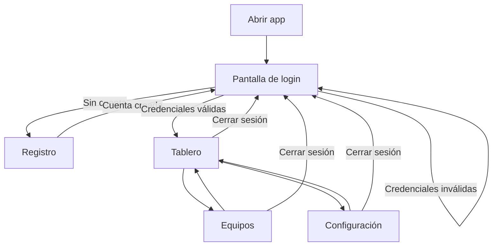
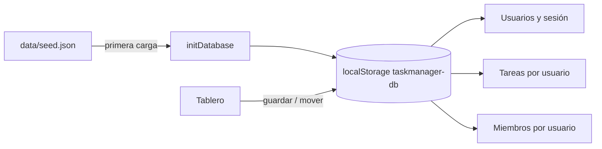

# TaskManager

Aplicación web de gestión de tareas en HTML, CSS y JavaScript vanilla. Sin frameworks ni backend: los datos se guardan en el navegador con `localStorage`.

## Requisitos

- Un servidor local (Live Server en VS Code, `npx serve`, etc.). No abras los HTML directamente con `file://` porque el seed y las vistas no cargarán correctamente.

## Inicio rápido

1. Clona o descarga el repositorio.
2. Abre la carpeta del proyecto con Live Server (o cualquier servidor estático).
3. Entra a `index.html` o a `views/auth/login.html`.
4. Regístrate con una cuenta nueva o inicia sesión si ya tienes una.

---

## Flujo de la aplicación



### 1. Registro

- Ruta: `views/auth/register.html`
- El usuario ingresa nombre, apellido, correo y contraseña.
- No se permiten correos duplicados.
- La cuenta se guarda en el almacén local (`taskmanager-db`).
- El **primer usuario** registrado recibe las tareas y miembros de ejemplo del archivo `data/seed.json`.
- Los usuarios siguientes empiezan con tablero y equipo vacíos.
- Tras registrarse, redirige al login.

### 2. Inicio de sesión

- Ruta: `views/auth/login.html`
- Solo pueden entrar usuarios ya registrados con correo y contraseña correctos.
- Si no hay cuenta o las credenciales fallan, se muestra un mensaje de error.
- Al iniciar sesión se guarda el `userId` en la sesión y se redirige al tablero.

### 3. Tablero

- Ruta: `views/board/board.html`
- Requiere sesión activa; si no hay sesión, redirige al login.
- Muestra tres columnas según el estado de cada tarea:
  - **Por hacer** → `todo`
  - **En progreso** → `in_progress`
  - **Finalizadas** → `done`
- Cada usuario ve **solo sus tareas**.
- Acciones disponibles:
  - **Buscar** tareas por título, descripción o categoría.
  - **Crear tarea** (modal centrado).
  - **Clic en tarjeta** → panel lateral con detalle editable.
  - **Arrastrar y soltar** tarjetas entre columnas → actualiza el estado y persiste el cambio.
- El sidebar muestra el nombre del usuario con sesión activa.

### 4. Equipos

- Ruta: `views/teams/teams.html`
- Requiere sesión activa.
- Cada usuario gestiona su propio listado de integrantes.
- Permite agregar, cambiar rol, eliminar y buscar miembros.
- Los cambios se guardan en `localStorage`.

### 5. Configuración

- Ruta: `views/settings/settings.html`
- Requiere sesión activa.
- Muestra y permite editar el perfil del usuario logueado (nombre, apellido, correo, bio).
- Permite cambiar el tema claro/oscuro.
- Permite cambiar el idioma (Español / English); la preferencia se aplica en toda la app.

### 6. Cerrar sesión

- Botón en el sidebar de cualquier página autenticada.
- Limpia la sesión y redirige al login.
- Los datos del usuario permanecen guardados para el próximo inicio de sesión.

---

## Persistencia de datos



| Clave | Contenido |
|-------|-----------|
| `taskmanager-db` | Objeto JSON con usuarios, sesión, tareas, miembros y tema |

Estructura simplificada:

```json
{
  "users": [{ "id", "name", "lastname", "email", "password", "bio" }],
  "session": "userId",
  "tasks": [{ "id", "userId", "title", "status", "..." }],
  "members": [{ "id", "userId", "name", "email", "role", "status" }],
  "theme": "light",
  "language": "es"
}
```

- `data/seed.json` solo se usa como datos iniciales la primera vez (o tras borrar `localStorage`).
- Los datos son **locales al navegador**: no hay sincronización entre dispositivos ni usuarios reales en red.
- Las contraseñas se guardan en texto plano (adecuado solo para demo local).

### Resetear datos

En DevTools → Application → Local Storage, elimina la clave `taskmanager-db` y recarga. Se volverá a cargar el seed.

---

## Estructura del proyecto

```
TaskManeger/
├── data/seed.json          # Datos iniciales de ejemplo
├── views/
│   ├── auth/               # Login y registro
│   ├── board/              # Tablero Kanban
│   ├── teams/              # Gestión de equipo
│   └── settings/           # Perfil y preferencias
├── JS/
│   ├── core/app.js         # Almacén, sesión, API TaskManager
│   └── pages/              # Lógica por página
└── CSS/                    # Estilos globales y por módulo
```

